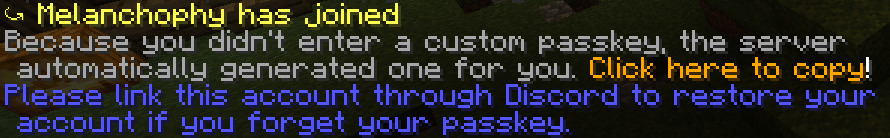
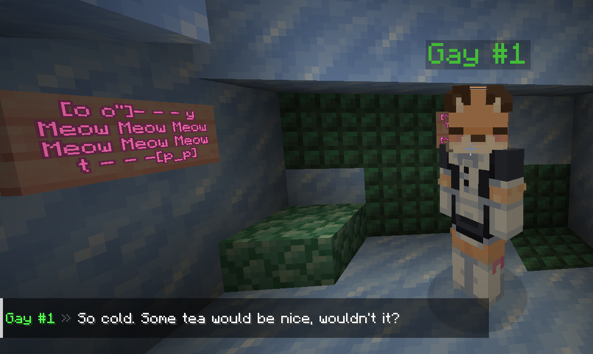

# DeltaHunter
DeltaHunter is an RPG server which can be self-hosted or modified to your hearts content. The server is primarily programmed using a plugin called Skript which features a very easy to understand programming language, as well as a couple other plugins for ease of development. 

## Features so far?
Keep in mind, DeltaHunter is not in a playable state yet. When there is stable version which includes some neat foundational features, then there will be a release here on GitHub.

**Working Torch Flowers**

**A Character Creator**

**Offline Account Support**

**Gay People**

## Contact Me/The Community
You can message or join me on Discord, my username is `Melanchophy` (Pronounced "Melan Coffee") or if you want to join the community, the invitation link to my Discord server is here:

[__💙 Parliament of Owls 💙__](https://discord.gg/fQUzhGpf3a)

# How to Play / Create Your Own Instance
Here are the steps to create and join your own instance of DeltaHunter. Remember to keep calm during each process:

Downloading all the required files.

1. A version of [PaperMC for 1.20.4](https://papermc.io/downloads/paper). Set the file name to __`Paper.jar`__!
2. The world file can be downloaded from [Mega](__https://mega.nz/file/wjcWUBZQ#HOGV5RQ72fgFK7v4rxCvpaYn8HkmYBr1n93piov-Pco__).
3. The config and Skripts from here on GitHub by selecting `Code` then `Download ZIP`
4. The following plugins used during development:
    - OPTIONAL - [Freedom Chat](https://modrinth.com/plugin/freedomchat) (`1.5.2`)
    - OPTIONAL - [Via Version](https://github.com/ViaVersion/ViaVersion/releases) (`4.9.3`)
    - OPTIONAL - [Fast Async World Edit](https://ci.athion.net/job/FastAsyncWorldEdit/) (`2.9.2-SNAPSHOT-708`)
    - [World Guard](https://dev.bukkit.org/projects/worldguard) (`7.0.9`)
    - [Skript](https://github.com/SkriptLang/Skript/releases) (`2.8.4`)
    - [SkBee](https://github.com/ShaneBeee/SkBee/releases) (`3.4.3`)
    - [DiSky](https://modrinth.com/plugin/disky/version/3utXU8e8) (`4.12.2-beta1`)
    - [Skript Particle](https://github.com/sovdeeth/skript-particle/releases) (`1.2.0`)
    - [Diskuise](https://github.com/UnderscoreTud/diskuise/releases) (`0.3.4`)
    - [ProtocolLib](https://www.spigotmc.org/resources/protocollib.1997/) (`5.2.0-SNAPSHOT-679`)
    - [Libs Disguises](https://github.com/libraryaddict/LibsDisguises/releases) (`10.0.42-Free`)
    - [Citizens](https://ci.citizensnpcs.co/job/Citizens2/) (`2.0.33-SNAPSHOT (build 3374)`)
    - [Mythic Mobs](https://mythiccraft.io/index.php?resources/mythicmobs.1/) (`5.6.1`)
    - [Mythic Skript Addon](https://github.com/BerndiVader/MythicSkriptAddon/releases) (`0.99.6`)
    - OPTIONAL - [Image on map](https://dev.bukkit.org/projects/imageonmap) (`4.2.2`)
    - OPTIONAL - [Skins Restorer](https://www.spigotmc.org/resources/skinsrestorer.2124/) (`15.0.7`)

Setting up DeltaHunter.

1. Create a new folder to contain the all the server files.
2. Extract the `.ZIP` within the new folder.
3. Paste the `Paper.jar` file in the folder.
4. To start the server, you may double click or in a Terminal use a command such as `java -jar ~/path/to/Paper.Jar`.

How to update.

- The world:
    - Download the latest world file.
    - Unzip the world file and replace the old world folder with the new world folder.

- The Skripts and config
    - Download the config and Skripts from here on GitHub by selecting `Code` then `Download ZIP`.
    - Unzip the file then drag and drop all the files into the server folder.
    - Your file manager will ask you what you'd like to do with the files. Just click on any option which says Replace.

# Special Thanks To...
Raspi_Dude, for providing a host to one of the instances (24/02/2024-Present). 

FOSS developers across the board and around the world. I'm so glad you all exist.

Grass, I touched it one time and it was nice.

